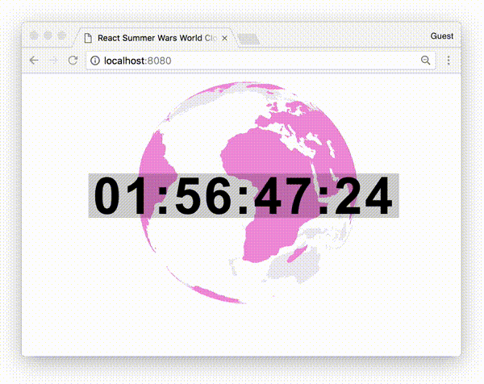

# react-summer-wars-world-clock
React Component of World Clock in Summer Wars

| branch | Travis status|
| --- | --- |
| [`master`](https://github.com/nwtgck/react-summer-wars-world-clock/tree/master) | [](https://travis-ci.com/nwtgck/react-summer-wars-world-clock) |
| [`develop`](https://github.com/nwtgck/react-summer-wars-world-clock/tree/develop) | [](https://travis-ci.com/nwtgck/react-summer-wars-world-clock) |



## NOTE: The Original Author

The original project is located in gist [shimizu/fde15aa8cf734f1219f8](https://gist.github.com/shimizu/fde15aa8cf734f1219f8) created by [@shimizu](https://github.com/shimizu/).  
Here, <https://shimz.me/blog/d3-js/4360>, is a blog post about the original project. Thank your very much, [@shimizu](https://github.com/shimizu/)!  
So I'm a just guy who packaged it into a react component.

## Install

 [](https://badge.fury.io/js/react-summer-wars-world-clock)

 ```bash
npm install -S react-summer-wars-world-clock
 ```

## Usage

Here is very simple jsx.

```jsx
import React from 'react'
import WorldClock from 'react-summer-wars-world-clock'
import ReactDOM   from 'react-dom';

class App extends React.Component {
  constructor(props){
    super(props)
  }

  render() {
    return (
      <div>
        <WorldClock />
      </div>
    )
  }
}
```

## Example

Here is an example project to use this component.  
<https://github.com/nwtgck/react-summer-wars-world-clock-example>